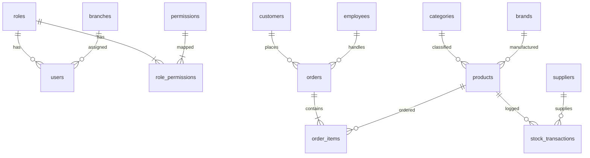

# Backend Design Report — Sales Management Platform

This report details the architectural and backend design for the Sales Management Platform (eManage). It is designed to fully support the frontend requirements, follow the coding conventions, and implement the business rules defined in the SRS.

## 1. Database Design

We will use PostgreSQL as the relational database. All table names are plural and snake_case, and column names are snake_case.

### 1.1 Database Tables

#### Table: `roles`
Stores authorization roles.
* `id` (INT / SERIAL): Primary Key.
* `name` (VARCHAR(50)): Unique, Not Null (e.g. `'ADMIN'`, `'BRANCH_MANAGER'`, `'CASHIER'`, `'INVENTORY_STAFF'`, `'ACCOUNTANT'`, `'CUSTOMER'`).
* `description` (VARCHAR(255)): Null.
* `created_at` (TIMESTAMP): Default `CURRENT_TIMESTAMP`.
* `updated_at` (TIMESTAMP): Default `CURRENT_TIMESTAMP`.

#### Table: `permissions`
Stores granular application permissions.
* `id` (INT / SERIAL): Primary Key.
* `name` (VARCHAR(100)): Unique, Not Null (e.g., `'ACCESS_POS'`, `'MANAGE_PRODUCTS'`).
* `description` (VARCHAR(255)): Null.
* `created_at` (TIMESTAMP): Default `CURRENT_TIMESTAMP`.

#### Table: `role_permissions`
Join table mapping roles to permissions (Many-to-Many).
* `role_id` (INT): Foreign Key references `roles(id)` ON DELETE CASCADE.
* `permission_id` (INT): Foreign Key references `permissions(id)` ON DELETE CASCADE.
* *Constraint*: Primary Key (`role_id`, `permission_id`).

#### Table: `branches`
Stores branch details.
* `id` (INT / SERIAL): Primary Key.
* `name` (VARCHAR(100)): Not Null.
* `address` (VARCHAR(255)): Null.
* `created_at` (TIMESTAMP): Default `CURRENT_TIMESTAMP`.
* `updated_at` (TIMESTAMP): Default `CURRENT_TIMESTAMP`.

#### Table: `users`
Stores user credentials and details.
* `id` (INT / SERIAL): Primary Key.
* `name` (VARCHAR(150)): Not Null.
* `email` (VARCHAR(100)): Unique, Not Null.
* `password` (VARCHAR(255)): Not Null (stored as BCrypt hash).
* `role_id` (INT): Foreign Key references `roles(id)`.
* `branch_id` (INT): Nullable. Foreign Key references `branches(id)`.
* `created_at` (TIMESTAMP): Default `CURRENT_TIMESTAMP`.
* `updated_at` (TIMESTAMP): Default `CURRENT_TIMESTAMP`.

#### Table: `categories`
Stores product categories.
* `id` (INT / SERIAL): Primary Key.
* `name` (VARCHAR(100)): Unique, Not Null.
* `description` (VARCHAR(255)): Null.
* `created_at` (TIMESTAMP): Default `CURRENT_TIMESTAMP`.
* `updated_at` (TIMESTAMP): Default `CURRENT_TIMESTAMP`.

#### Table: `brands`
Stores product brands.
* `id` (INT / SERIAL): Primary Key.
* `name` (VARCHAR(100)): Unique, Not Null.
* `description` (VARCHAR(255)): Null.
* `created_at` (TIMESTAMP): Default `CURRENT_TIMESTAMP`.
* `updated_at` (TIMESTAMP): Default `CURRENT_TIMESTAMP`.

#### Table: `products`
Stores product details.
* `id` (INT / SERIAL): Primary Key.
* `sku` (VARCHAR(50)): Unique, Not Null.
* `name` (VARCHAR(255)): Not Null.
* `category_id` (INT): Nullable. Foreign Key references `categories(id)` ON DELETE SET NULL.
* `brand_id` (INT): Nullable. Foreign Key references `brands(id)` ON DELETE SET NULL.
* `cost_price` (DECIMAL(15, 2)): Default `0.00`.
* `sale_price` (DECIMAL(15, 2)): Default `0.00`.
* `stock` (INT): Default `0`.
* `image` (VARCHAR(255)): Null.
* `description` (TEXT): Null.
* `active` (BOOLEAN): Default `true` (soft delete flag).
* `created_at` (TIMESTAMP): Default `CURRENT_TIMESTAMP`.
* `updated_at` (TIMESTAMP): Default `CURRENT_TIMESTAMP`.

#### Table: `customers`
Stores customer records.
* `id` (INT / SERIAL): Primary Key.
* `code` (VARCHAR(50)): Unique, Not Null (e.g. `'KH00001'`).
* `name` (VARCHAR(150)): Not Null.
* `phone` (VARCHAR(20)): Unique, Not Null.
* `email` (VARCHAR(100)): Null.
* `address` (VARCHAR(255)): Null.
* `points` (INT): Default `0`.
* `created_at` (TIMESTAMP): Default `CURRENT_TIMESTAMP`.
* `updated_at` (TIMESTAMP): Default `CURRENT_TIMESTAMP`.

#### Table: `suppliers`
Stores supplier details.
* `id` (INT / SERIAL): Primary Key.
* `name` (VARCHAR(150)): Not Null.
* `phone` (VARCHAR(20)): Null.
* `email` (VARCHAR(100)): Null.
* `address` (VARCHAR(255)): Null.
* `created_at` (TIMESTAMP): Default `CURRENT_TIMESTAMP`.
* `updated_at` (TIMESTAMP): Default `CURRENT_TIMESTAMP`.

#### Table: `employees`
Stores employee records.
* `id` (INT / SERIAL): Primary Key.
* `name` (VARCHAR(150)): Not Null.
* `role` (VARCHAR(50)): Not Null (e.g. `'Nhân viên bán hàng'`).
* `phone` (VARCHAR(20)): Null.
* `email` (VARCHAR(100)): Null.
* `created_at` (TIMESTAMP): Default `CURRENT_TIMESTAMP`.
* `updated_at` (TIMESTAMP): Default `CURRENT_TIMESTAMP`.

#### Table: `orders`
Stores sales order headers.
* `id` (INT / SERIAL): Primary Key.
* `code` (VARCHAR(50)): Unique, Not Null (e.g. `'HD00001'`).
* `customer_id` (INT): Nullable. Foreign Key references `customers(id)` ON DELETE SET NULL.
* `employee_id` (INT): Nullable. Foreign Key references `employees(id)` ON DELETE SET NULL.
* `total` (DECIMAL(15, 2)): Not Null.
* `discount` (DECIMAL(15, 2)): Default `0.00`.
* `payment_method` (VARCHAR(20)): Not Null (e.g. `'cash'`, `'transfer'`).
* `status` (VARCHAR(20)): Not Null (e.g. `'pending'`, `'processing'`, `'completed'`, `'cancelled'`).
* `note` (TEXT): Null.
* `created_at` (TIMESTAMP): Default `CURRENT_TIMESTAMP`.
* `updated_at` (TIMESTAMP): Default `CURRENT_TIMESTAMP`.

#### Table: `order_items`
Stores line items for sales orders.
* `id` (INT / SERIAL): Primary Key.
* `order_id` (INT): Foreign Key references `orders(id)` ON DELETE CASCADE.
* `product_id` (INT): Nullable. Foreign Key references `products(id)` ON DELETE SET NULL.
* `product_name` (VARCHAR(255)): Not Null.
* `price` (DECIMAL(15, 2)): Not Null.
* `quantity` (INT): Not Null.

#### Table: `stock_transactions`
Stores stock movement logs (imports/exports).
* `id` (INT / SERIAL): Primary Key.
* `product_id` (INT): Foreign Key references `products(id)` ON DELETE CASCADE.
* `type` (VARCHAR(10)): Not Null (e.g. `'import'`, `'export'`).
* `quantity` (INT): Not Null.
* `supplier_id` (INT): Nullable. Foreign Key references `suppliers(id)` ON DELETE SET NULL.
* `note` (TEXT): Null.
* `created_at` (TIMESTAMP): Default `CURRENT_TIMESTAMP`.

#### Table: `settings`
Stores system configuration (single row).
* `id` (INT): Primary Key (Value will always be `1`).
* `store_name` (VARCHAR(150)): Not Null.
* `address` (VARCHAR(255)): Null.
* `phone` (VARCHAR(20)): Null.
* `email` (VARCHAR(100)): Null.
* `tax_code` (VARCHAR(50)): Null.
* `updated_at` (TIMESTAMP): Default `CURRENT_TIMESTAMP`.

---

### 1.2 Entity Relationship Diagram (ERD)



---

## 2. API Design & Security

All APIs will be prefixed with `/api`. Standard responses match the JSON conventions expected by the frontend.

### 2.1 Security & RBAC Design
1. **Authentication Flow**:
   * Users authenticate via `POST /api/auth/login` sending `email` and `password`.
   * Backend verifies credentials and issues a signed JWT containing username, role, and branch ID.
   * Client stores the user details and JWT. Subsequent requests pass the JWT in the `Authorization: Bearer <token>` header.
2. **Authorization Control**:
   * Granular URL and method-level access checked via Spring Security matching Roles/Permissions.
   * *Admin Only*: Dashboard view (`/`), Settings modification (`/settings`), user management.
   * *Branch Manager*: Product views, Customer & Supplier management, reports, stock transfers.
   * *Cashier*: POS operations, order creation, order list viewing.
   * *Inventory*: Stock import/export, history tracking, stock view.

---

### 2.2 Endpoint Registry

| Method | Endpoint | Authorized Roles | Description |
|---|---|---|---|
| **POST** | `/api/auth/login` | *Public* | Logs in user, returns JWT and user payload |
| **POST** | `/api/auth/register` | *Public* | Registers a new Store Admin + initial config |
| **GET** | `/api/categories` | ADMIN, BRANCH_MANAGER, INVENTORY_STAFF | List all categories, filters by `search` |
| **POST** | `/api/categories` | ADMIN, BRANCH_MANAGER | Creates a new category |
| **PUT** | `/api/categories/{id}` | ADMIN, BRANCH_MANAGER | Updates an existing category |
| **DELETE** | `/api/categories/{id}` | ADMIN, BRANCH_MANAGER | Deletes a category |
| **GET** | `/api/brands` | ADMIN, BRANCH_MANAGER, INVENTORY_STAFF | List all brands, filters by `search` |
| **POST** | `/api/brands` | ADMIN, BRANCH_MANAGER | Creates a new brand |
| **PUT** | `/api/brands/{id}` | ADMIN, BRANCH_MANAGER | Updates an existing brand |
| **DELETE** | `/api/brands/{id}` | ADMIN, BRANCH_MANAGER | Deletes a brand |
| **GET** | `/api/products` | ADMIN, BRANCH_MANAGER, INVENTORY_STAFF, CASHIER | Paginated product list, search/filter |
| **GET** | `/api/products/{id}` | ADMIN, BRANCH_MANAGER, INVENTORY_STAFF | View product detail |
| **POST** | `/api/products` | ADMIN, BRANCH_MANAGER | Creates a product |
| **PUT** | `/api/products/{id}` | ADMIN, BRANCH_MANAGER | Updates a product |
| **DELETE** | `/api/products/{id}` | ADMIN, BRANCH_MANAGER | Soft deletes a product (active = false) |
| **GET** | `/api/customers` | ADMIN, BRANCH_MANAGER, CASHIER | List all customers, search by name/phone |
| **POST** | `/api/customers` | ADMIN, BRANCH_MANAGER, CASHIER | Creates a customer |
| **PUT** | `/api/customers/{id}` | ADMIN, BRANCH_MANAGER | Updates customer details |
| **DELETE** | `/api/customers/{id}` | ADMIN, BRANCH_MANAGER | Deletes a customer |
| **GET** | `/api/suppliers` | ADMIN, BRANCH_MANAGER | List all suppliers |
| **POST** | `/api/suppliers` | ADMIN, BRANCH_MANAGER | Creates a supplier |
| **PUT** | `/api/suppliers/{id}` | ADMIN, BRANCH_MANAGER | Updates supplier details |
| **DELETE** | `/api/suppliers/{id}` | ADMIN, BRANCH_MANAGER | Deletes a supplier |
| **GET** | `/api/employees` | ADMIN, BRANCH_MANAGER | List all employees |
| **POST** | `/api/employees` | ADMIN, BRANCH_MANAGER | Creates an employee |
| **PUT** | `/api/employees/{id}` | ADMIN, BRANCH_MANAGER | Updates employee details |
| **DELETE** | `/api/employees/{id}` | ADMIN, BRANCH_MANAGER | Deletes an employee |
| **GET** | `/api/orders` | ADMIN, BRANCH_MANAGER, CASHIER | Paginated order list, status filter |
| **GET** | `/api/orders/{id}` | ADMIN, BRANCH_MANAGER, CASHIER | Get order detail with items |
| **POST** | `/api/orders` | ADMIN, CASHIER | POS Order checkout |
| **PUT** | `/api/orders/{id}` | ADMIN, BRANCH_MANAGER | Update order status |
| **GET** | `/api/stock` | ADMIN, BRANCH_MANAGER, INVENTORY_STAFF | List stock status of active products |
| **GET** | `/api/stock/history` | ADMIN, BRANCH_MANAGER, INVENTORY_STAFF | List stock transactions (imports/exports) |
| **POST** | `/api/stock/import` | ADMIN, BRANCH_MANAGER, INVENTORY_STAFF | Records a product stock entry |
| **POST** | `/api/stock/export` | ADMIN, BRANCH_MANAGER, INVENTORY_STAFF | Records a product stock deduction |
| **GET** | `/api/dashboard` | ADMIN, BRANCH_MANAGER | View business performance statistics |
| **GET** | `/api/settings` | ADMIN | View store configuration settings |
| **PUT** | `/api/settings` | ADMIN | Update store configuration settings |

---

## 3. Request / Response DTO Design

Java variables are camelCase. They automatically map to JSON properties.

### 3.1 DTO Structures

#### DTO: `CategoryRequest`
* `name` (String, `@NotBlank`, max: 100): "Tên danh mục là bắt buộc"
* `description` (String, max: 255)

#### DTO: `CategoryResponse`
* `id` (Integer)
* `name` (String)
* `description` (String)
* `createdAt` (LocalDateTime)

#### DTO: `ProductRequest`
* `sku` (String, `@NotBlank`, max: 50): "SKU là bắt buộc"
* `name` (String, `@NotBlank`, max: 255): "Tên sản phẩm là bắt buộc"
* `categoryId` (Integer)
* `brandId` (Integer)
* `costPrice` (Double, `@Min(0)`): "Giá nhập không được âm"
* `salePrice` (Double, `@Min(0)`): "Giá bán không được âm"
* `stock` (Integer, `@Min(0)`): "Số lượng tồn không được âm"
* `image` (String)
* `description` (String)

#### DTO: `ProductResponse`
* `id` (Integer)
* `sku` (String)
* `name` (String)
* `categoryId` (Integer)
* `categoryName` (String)
* `brandId` (Integer)
* `brandName` (String)
* `costPrice` (Double)
* `salePrice` (Double)
* `stock` (Integer)
* `image` (String)
* `description` (String)
* `createdAt` (LocalDateTime)

#### DTO: `CustomerRequest`
* `name` (String, `@NotBlank`): "Tên khách hàng là bắt buộc"
* `phone` (String, `@NotBlank`): "Số điện thoại là bắt buộc"
* `email` (String)
* `address` (String)

#### DTO: `CustomerResponse`
* `id` (Integer)
* `code` (String)
* `name` (String)
* `phone` (String)
* `email` (String)
* `address` (String)
* `points` (Integer)
* `createdAt` (LocalDateTime)

#### DTO: `OrderItemRequest`
* `productId` (Integer, `@NotNull`)
* `productName` (String, `@NotBlank`)
* `price` (Double, `@NotNull`)
* `quantity` (Integer, `@NotNull`, `@Min(1)`)

#### DTO: `OrderRequest`
* `customerId` (Integer)
* `employeeId` (String) -> mapped from UI mockup
* `items` (List<OrderItemRequest>, `@NotEmpty`)
* `discount` (Double)
* `paymentMethod` (String, `@NotBlank`)
* `note` (String)

#### DTO: `OrderResponse`
* `id` (Integer)
* `code` (String)
* `customerName` (String)
* `employeeName` (String)
* `createdAt` (LocalDateTime)
* `total` (Double)
* `discount` (Double)
* `paymentMethod` (String)
* `status` (String)
* `note` (String)
* `items` (List<OrderItemResponse>)

#### DTO: `StockImportRequest`
* `productId` (Integer, `@NotNull`): "Vui lòng chọn sản phẩm"
* `quantity` (Integer, `@NotNull`, `@Min(1)`): "Số lượng nhập phải lớn hơn 0"
* `supplierId` (Integer)
* `note` (String)

#### DTO: `StockExportRequest`
* `productId` (Integer, `@NotNull`): "Vui lòng chọn sản phẩm"
* `quantity` (Integer, `@NotNull`, `@Min(1)`): "Số lượng xuất phải lớn hơn 0"
* `note` (String)

---

## 4. Error Response & Exception Handling

We will implement a unified `@RestControllerAdvice` handling exceptions. The error messages will be returned in **Vietnamese** as required by the coding conventions.

### 4.1 Error Response JSON format
All errors return a JSON payload with a single `message` field:
```json
{
  "message": "Thông điệp lỗi chi tiết ở đây"
}
```

### 4.2 Standard HTTP Status Mappings

* **400 Bad Request**:
  * Validation errors (e.g. `@NotBlank` field missing). Message format: Concatenation of validation violations.
  * Invalid state transitions or operations (e.g. exporting more than available stock).
* **401 Unauthorized**:
  * Missing or expired JWT token.
* **403 Forbidden**:
  * User role lacks permission to invoke the endpoint.
* **404 Not Found**:
  * Entity not found (e.g. product or category does not exist).
* **500 Internal Server Error**:
  * Unexpected system/database errors.

---

## 5. Verification Plan

We will verify all changes locally before deployment.

### 5.1 Automated Tests
* Run Unit and Integration tests using Maven:
  ```powershell
  mvn clean test
  ```

### 5.2 Manual Verification
* Deploy the Backend locally on port `3001`.
* Run the Frontend locally on port `3000` (Vite dev server) which proxies `/api` to backend.
* Perform test scenarios:
  1. Login / registration validation.
  2. Products CRUD (creating, editing, and soft deleting). Check if stock is updated properly.
  3. POS checkout workflow: check if stock decreases, points accumulate, and sales orders are recorded correctly in the DB.
  4. Stock entry and deductions: verify history and on-hand inventory levels.
  5. Dashboard charts updates matching the DB numbers.
